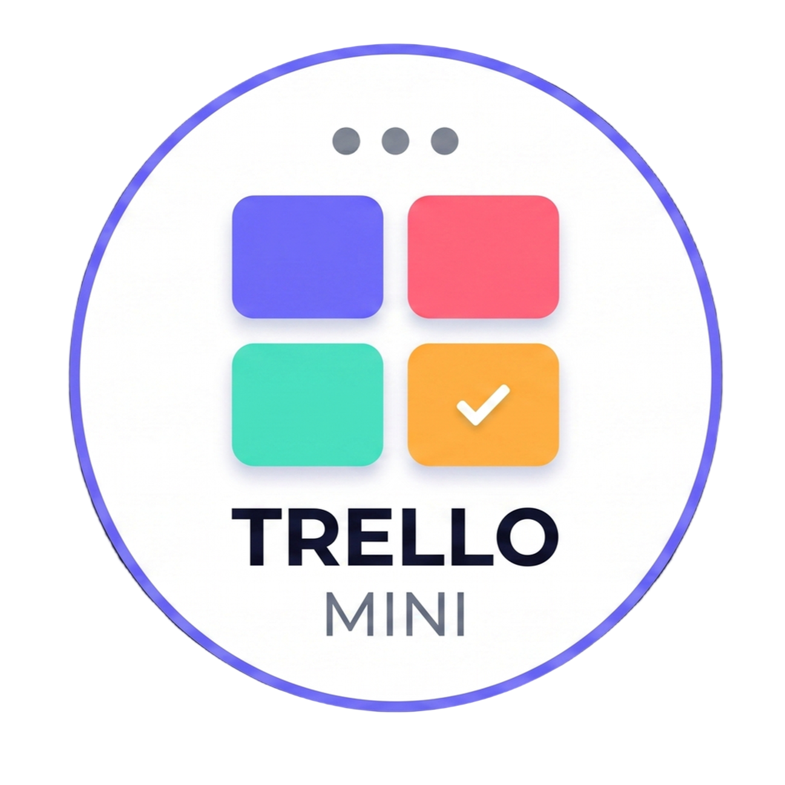

# Taskly — Full-Stack Trello Clone



Taskly adalah aplikasi manajemen proyek berbasis Kanban board, dibuat sebagai tugas akhir (Final Internship Project) untuk Codveda. Aplikasi ini memungkinkan pengguna untuk membuat *board*, *list*, dan memindahkan *card* tugas dengan fitur *drag-and-drop* yang intuitif, serta diamankan menggunakan autentikasi berbasis JWT.

## ✨ Fitur Utama
- **Autentikasi Aman:** Sistem Login dan Register menggunakan JWT (JSON Web Token) dan enkripsi *password* menggunakan bcrypt.
- **Kanban Board Interaktif:** Pengguna dapat membuat *Board*, *List*, dan *Card* dengan operasi CRUD penuh.
- **Drag & Drop:** Pindahkan *card* antar daftar dengan mulus menggunakan `@hello-pangea/dnd`.
- **Desain Modern:** UI yang responsif dan sangat menarik dengan tema *Vibrant Aurora* yang terang.
- **Background Jobs (Cron):** Sistem *ping* otomatis ke MongoDB Atlas setiap pukul 08:00 WIB untuk mencegah *database* tidur (*auto-pause*) pada tier gratis.
- **Label & Prioritas:** Berikan warna, label, tanggal tenggat (*due date*), serta atur prioritas pada setiap tugas.

## 🛠️ Teknologi yang Digunakan

Aplikasi ini menggunakan arsitektur **MERN Stack**:

### Frontend
- **React.js** (dikompilasi menggunakan Vite untuk performa maksimal)
- **React Router DOM** (untuk routing dan *protected routes*)
- **Axios** (koneksi API & *interceptor* JWT)
- **@hello-pangea/dnd** (library *drag-and-drop* modern)
- **Lucide React** (ikon SVG berbasis *stroke*)
- **Vanilla CSS** (sistem desain *custom* tanpa framework)

### Backend
- **Node.js & Express.js** (server API)
- **MongoDB & Mongoose** (database NoSQL dan pemodelan data)
- **JWT (jsonwebtoken)** (otorisasi berbasis sesi tanpa *state*)
- **Bcrypt.js** (hashing *password*)
- **Node-Cron** (penjadwalan tugas latar belakang)

---

## 🚀 Cara Menjalankan Aplikasi Secara Lokal

### 1. Persyaratan Sistem
Pastikan di komputer Anda sudah terinstal:
- [Node.js](https://nodejs.org/) (versi 16 atau lebih baru)
- Akses ke [MongoDB Atlas](https://www.mongodb.com/atlas) atau MongoDB lokal.

### 2. Instalasi Dependensi
Buka terminal di *root folder* proyek ini dan jalankan perintah berikut untuk menginstal semua modul (baik untuk frontend maupun backend):
```bash
npm run install:all
```

### 3. Konfigurasi Environment Variables
Buka folder `server/`. Di sana terdapat file `.env.example`. Salin dan ubah namanya menjadi `.env`.
```bash
cp server/.env.example server/.env
```
Lalu buka file `server/.env` tersebut dan masukkan URL koneksi MongoDB Anda beserta JWT Secret.

Contoh `.env`:
```env
NODE_ENV=development
PORT=5000
MONGO_URI=mongodb+srv://<username>:<password>@cluster0.mongodb.net/taskly?retryWrites=true&w=majority
JWT_SECRET=super_secret_key_anda_yang_sangat_panjang_sekali
JWT_EXPIRE=7d
CLIENT_URL=http://localhost:5173
```

### 4. Jalankan Aplikasi
Proyek ini sudah dikonfigurasi menggunakan paket `concurrently`. Anda bisa menjalankan backend dan frontend secara bersamaan hanya dengan **satu perintah** dari folder *root* proyek:

```bash
npm run dev
```

Jika berhasil, Anda akan melihat pesan berikut di terminal:
- `[SERVER] 🚀 Server running on port 5000`
- `[SERVER] ✅ MongoDB Connected`
- `[CLIENT] ➜ Local: http://localhost:5173/`

Buka **http://localhost:5173** di *browser* Anda untuk mulai menggunakan Taskly!

---
*Dibangun dengan ❤️ untuk tugas akhir magang.*
